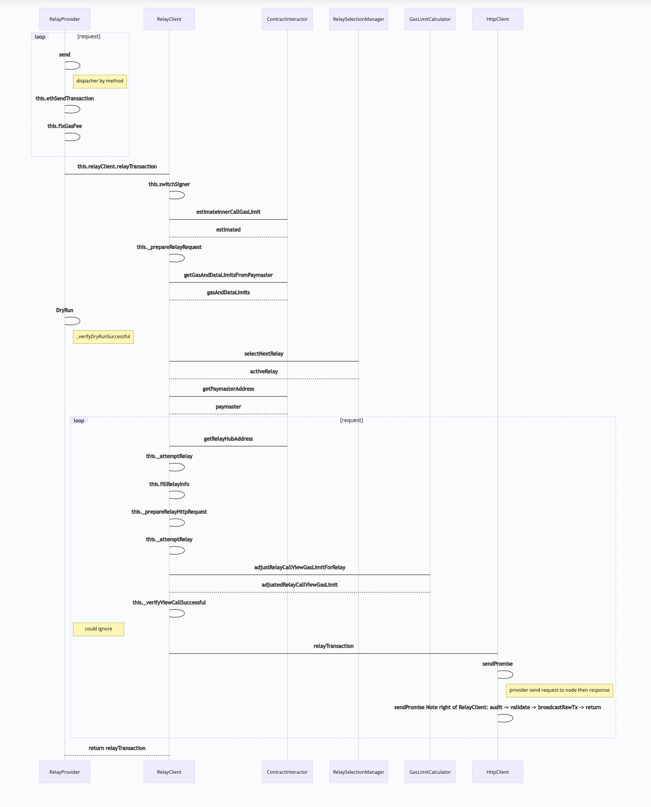

# provider
仿照**https://github.com/opengsn/gsn**开发go语言版本的gsn provider<br>
v1.0.0: 打通流程，完成核心功能

## AccountManager
处理 account 相关，例如私钥、签名  

### func
    - addAccount
    - switchSigner

## RelayProvider
主要负责封装request, 分发请求
### func
    - NewRelayProvider
    - Request
    - send
    - ethSendTransaction

## RelayClient
处理与node交互
### func
    - NewRelayClient(GSNConfig, GSNDependencies)
    - relayTransaction
    - prepareRelayRequest
    - attemptRelay

## GSNConfigurator

## RelaySelectionManager
处理Relay服务的选择
### func
    - NewRelaySelectionManager
    - relayLeft
    - selectNextRelay

# common
提供公共服务，公用对象，工具类等

## ContractInteractor
存放paymaster、relayHub的实例

### func
    - NewContractInteractor
    - init
    - resolveDeployment
    - getDeployment
    - initDeployment
    - broadcastTransaction
    - estimateInnerCallGasLimit
    - getGasAndDataLimitsFromPaymaster
    - getBlockNumberRightNow

## IPaymaster
paymaster 合约交互


### opengsn eth_sendTransaction 时序图


### 入参
```json
{
    "gas": "0xa84e",
    "from": "0xd3cff20db7af99bf6caf0a1247afe5bc63664172",
    "to": "0xa6c1a5b6b52fb299edd8e9cf02b63c980176bfe3",
    "data": "0xa9059cbb000000000000000000000000693438ff63fedd1559870fbe2b1ad4128b74468e000000000000000000000000000000000000000000000000a6cf9e50b8320000"
}
```

### 出参
```json
{
    "relayRequest": {
        "request": {
            "to": "0xa6c1a5b6b52fb299edd8e9cf02b63c980176bfe3",
            "data": "0xa9059cbb000000000000000000000000693438ff63fedd1559870fbe2b1ad4128b74468e000000000000000000000000000000000000000000000000a6cf9e50b8320000",
            "from": "0xd3cff20db7af99bf6caf0a1247afe5bc63664172",
            "value": "0",
            "nonce": "374",
            "gas": "43086",
            "validUntilTime": "1716692351"
        },
        "relayData": {
            "relayWorker": "0x23bbd3ed8d813d087b122bb977cacf8e7f60d247",
            "transactionCalldataGasUsed": "0x6f54",
            "paymasterData": "0x",
            "maxFeePerGas": "0x1251dd",
            "maxPriorityFeePerGas": "0xf433c",
            "paymaster": "0xCB798E55717978669Bf3F9A29cC117c7ea37a4A2",
            "clientId": "1",
            "forwarder": "0xCFbFCfA99f4a8CeBFDb90a1E424Bb146c16A182B"
        }
    },
    "metadata": {
        "domainSeparatorName": "GSN Relayed Transaction",
        "maxAcceptanceBudget": "285252",
        "relayHubAddress": "0x3f1F0D5F8a50C82e71dAE33a7dbe1E6207AA9918",
        "relayRequestId": "0x000000002572884689d6d384e4db5e9423d596f78823997aa6dd2574c141f981",
        "signature": "0xc3540bf725b89a52fe42dddbee5aa9f743b4b361607df4e97b711fcc13f501674ec537704cdfc7cafcdfd22e35dd325a6fa2f871c823be6ecb2307eab175e1c21c",
        "approvalData": "0x",
        "relayMaxNonce": 2964,
        "relayLastKnownNonce": 2961
    }
}
```
