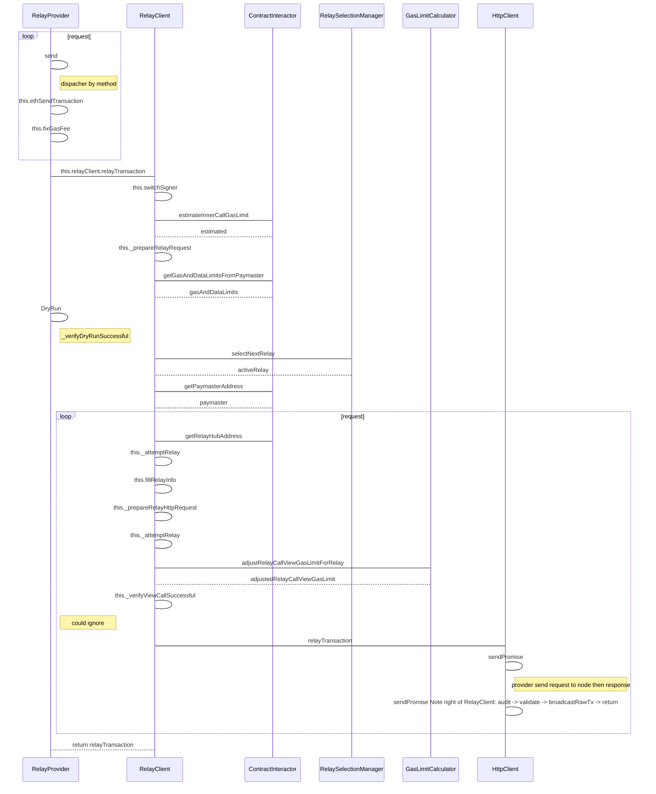

### 1. opengsn_provider: eth_sendTransaction主流程

```mermaid
sequenceDiagram
  participant RelayProvider
  participant RelayClient  
  participant ContractInteractor  
  participant RelaySelectionManager 
  participant GasLimitCalculator  
  participant HttpClient  
 

  loop request
  RelayProvider->RelayProvider: send
	Note right of RelayProvider: dispacher by method
  RelayProvider->RelayProvider: this.ethSendTransaction
  RelayProvider->RelayProvider: this.fixGasFee
 end 

RelayProvider->RelayClient: this.relayClient.relayTransaction
RelayClient->RelayClient: this.switchSigner
RelayClient->ContractInteractor: estimateInnerCallGasLimit
ContractInteractor-->RelayClient: estimated
RelayClient->RelayClient: this._prepareRelayRequest
RelayClient->ContractInteractor:getGasAndDataLimitsFromPaymaster
ContractInteractor-->RelayClient:gasAndDataLimits
RelayProvider->RelayProvider: DryRun
Note right of RelayProvider: _verifyDryRunSuccessful
RelayClient->RelaySelectionManager:selectNextRelay
RelaySelectionManager-->RelayClient:activeRelay
RelayClient->ContractInteractor:getPaymasterAddress
ContractInteractor-->RelayClient:paymaster

loop request
  RelayClient->ContractInteractor: getRelayHubAddress
  RelayClient->RelayClient: this._attemptRelay
  RelayClient->RelayClient: this.fillRelayInfo
  RelayClient->RelayClient: this._prepareRelayHttpRequest
  RelayClient->RelayClient: this._attemptRelay

  RelayClient->GasLimitCalculator: adjustRelayCallViewGasLimitForRelay
  GasLimitCalculator-->RelayClient: adjustedRelayCallViewGasLimit
  RelayClient->RelayClient: this._verifyViewCallSuccessful
  Note right of RelayProvider: could ignore
  RelayClient->HttpClient: relayTransaction
  HttpClient->HttpClient:  sendPromise
  Note right of HttpClient: provider send request to node then response
  HttpClient->HttpClient:  sendPromise  Note right of RelayClient: audit -> validate -> broadcastRawTx -> return
 end
RelayClient-->RelayProvider:  return relayTransaction
```

